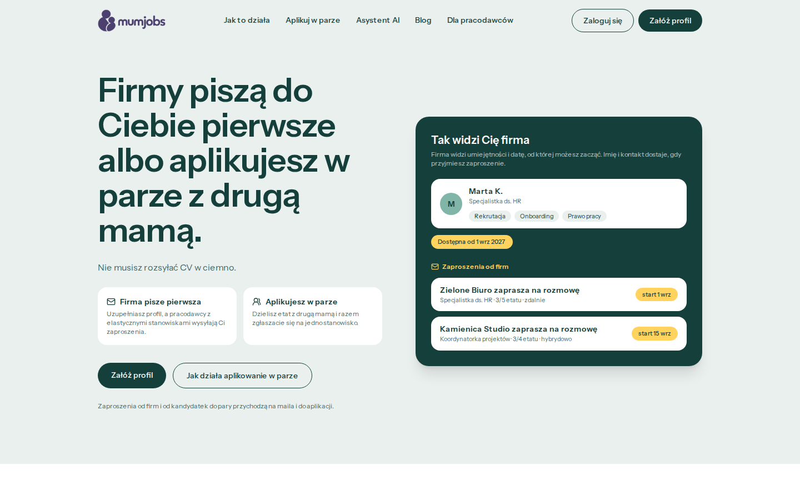
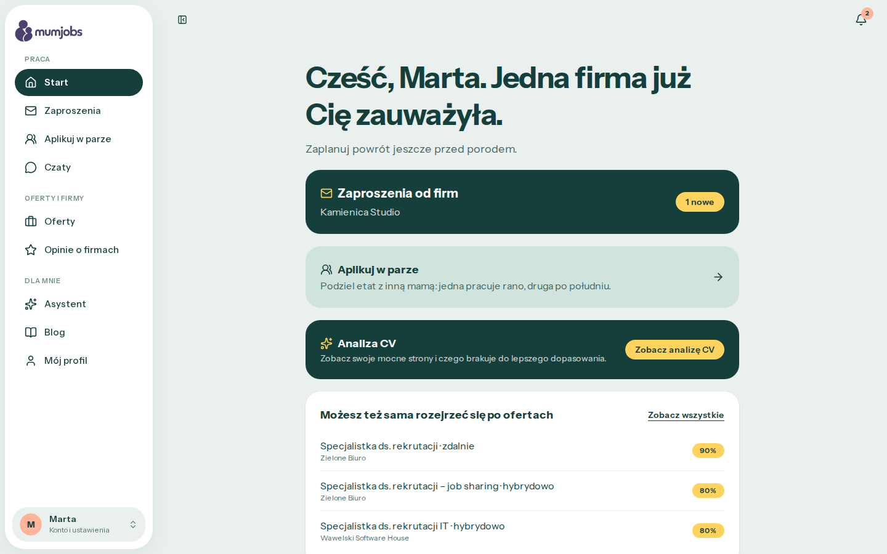
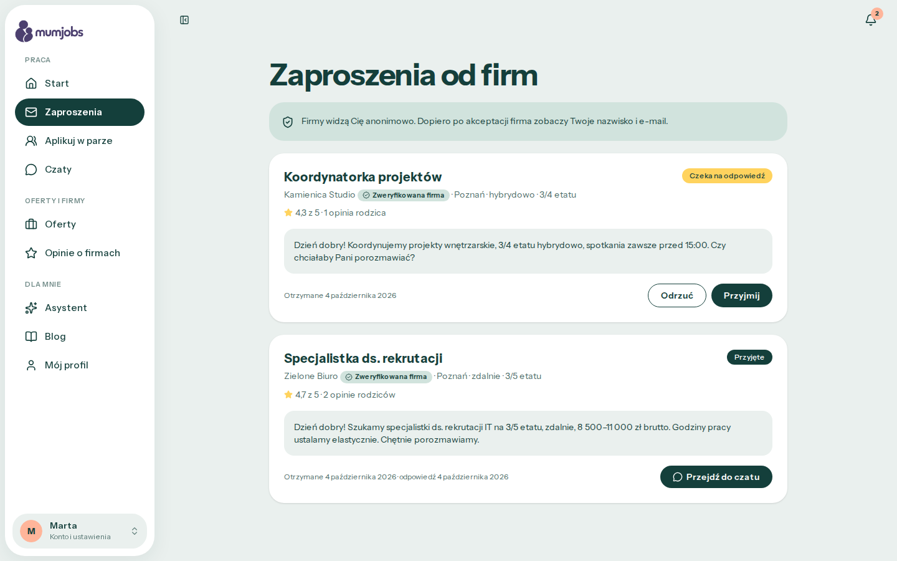
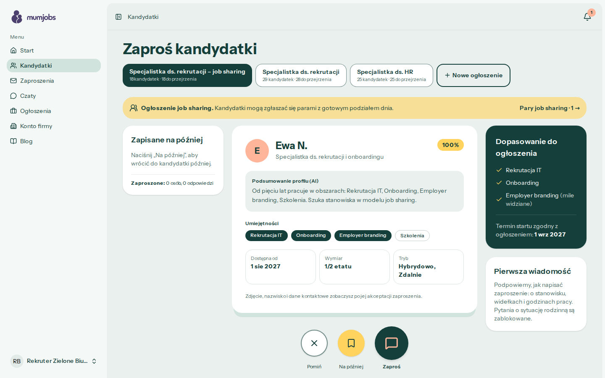
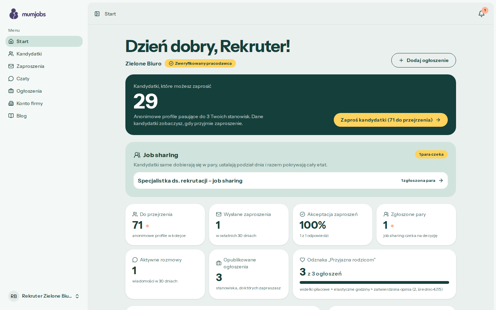
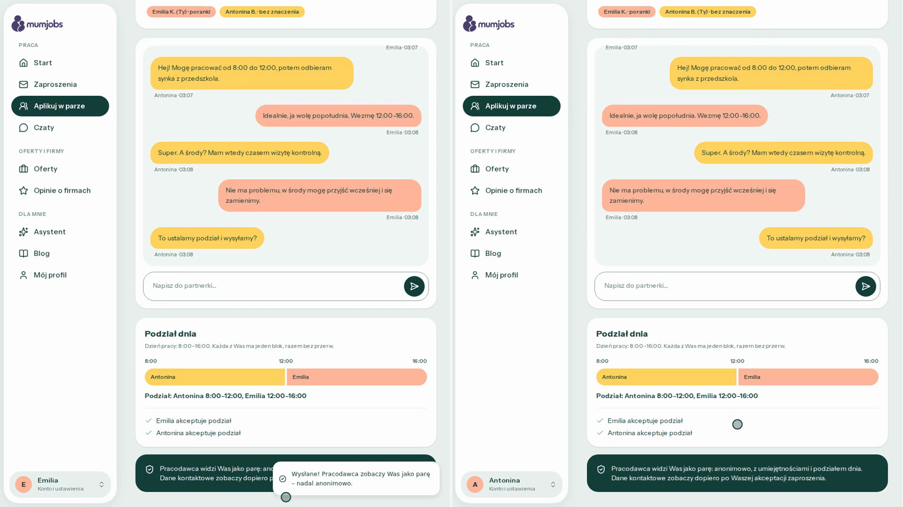
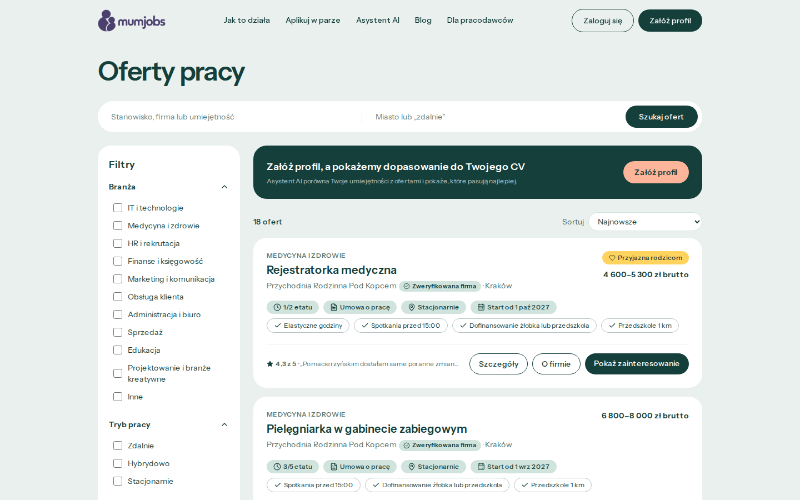
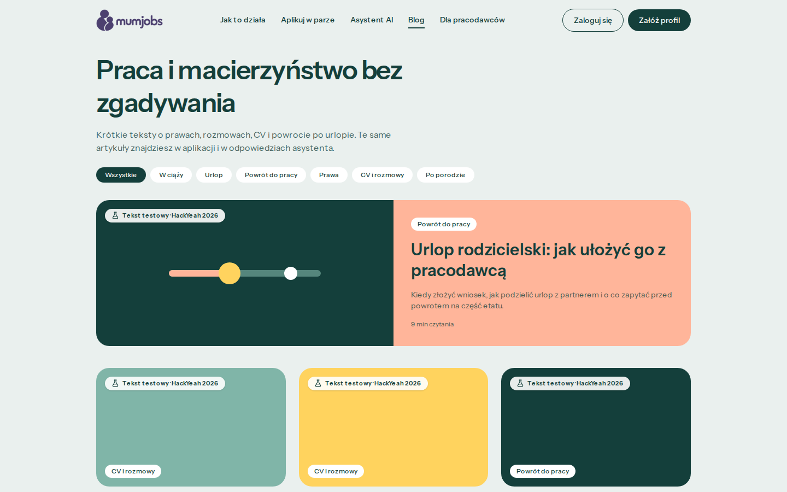
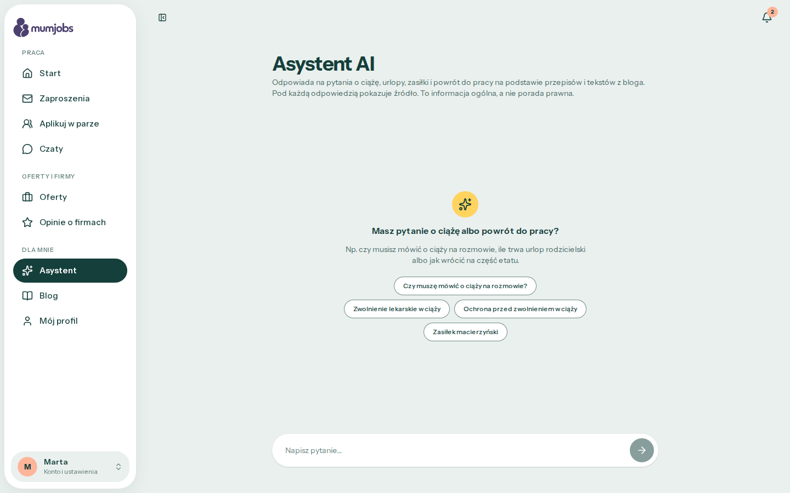
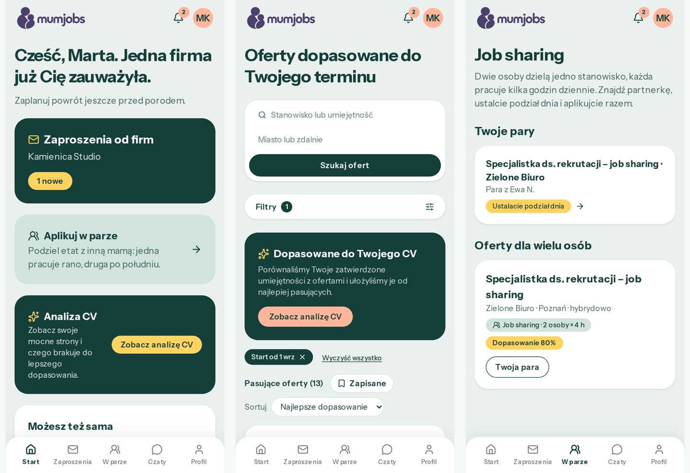

# MumJobs

MumJobs helps women get back to work after maternity leave. We built it at HackYeah 2026.



After a year or a few months at home with a child, many mothers want to come back part-time, in hours that work
around nursery pick-up. Finding that through job ads usually means sending dozens of CVs and explaining the gap
in each one. In mumjobs a candidate doesn't send CVs at all. She can come back in one of two ways.

### Companies write to her

She fills in an anonymous profile with her skills, preferred hours and the date she can start. Employers browse
profiles that match their postings and send invitations. A company learns her name and phone number only after
she accepts.

### She applies together with another mum

Two candidates share one full-time job: one works mornings, the other afternoons. They agree on the split in a
pair chat and send one application together. A candidate can find a partner among suggested profiles or invite
a friend with a link.

There is also a regular list of offers, a blog for pregnant women and new mums, and an AI assistant that answers
general questions about leave, benefits and going back to work.

## Screenshots

| Candidate home | Invitations from companies |
|---|---|
|  |  |

| What an employer sees | Employer dashboard |
|---|---|
|  |  |

In the pair chat, Emilia and Antonina agree that one works 8:00–12:00 and the other 12:00–16:00, then send the
pair to the employer:



| Offers with filters | Blog for mums |
|---|---|
|  |  |

| AI assistant | On a phone |
|---|---|
|  |  |

## What's inside

### For candidates

The profile shows employers her skills, preferred hours and the date she is available from. Whether she is
pregnant or on leave stays visible only to her. After she uploads a CV, the AI suggests skills and shows what is
missing for the offers that match her. Invitations from companies wait for her answer, and the chat with a
company opens only after she accepts.

For job sharing she gets partner suggestions for multi-person offers, an invite link for friends, a pair chat
and a shared schedule that both partners confirm before sending.

The offer list can be filtered by:

- industry, work mode, working hours and contract type,
- perks for parents: flexible hours, meetings before 15:00, a childcare subsidy, a nursery nearby,
- companies with parent reviews or verified companies only.

Parents rate companies on how they handled the return from leave, how flexible the hours are and whether
interviews stayed free of pregnancy questions. The blog covers pregnancy, leave and benefits, the weeks after
giving birth and the return to work. The AI assistant answers from a small set of Polish labour-law sources and
blog articles and links the source under every answer. It gives general information, not legal advice.

### For employers

Each posting gets its own queue of matching candidates with skills and a match score. When an employer writes
an invitation, the app suggests what to ask, and the chat blocks questions about pregnancy or family plans.
Postings can accept pairs, who arrive with the day split already agreed. A posting earns the "parent-friendly"
badge when it has a salary range, flexible hours and at least one approved review of the company.

### Platform

The web app runs on Laravel with Inertia/Vue and server-side rendering. The same backend serves a REST API
(`/api/v1`) for the native Android app. Admins moderate reviews, verify companies and edit blog articles and the
assistant's legal sources.

## Tech stack

| Layer | |
|---|---|
| Backend | PHP 8.5, Laravel 13, Fortify (login, passkeys), Sanctum (API tokens) |
| Frontend | Inertia 3, Vue 3, Tailwind CSS 4, Wayfinder (typed routes), SSR |
| AI | Claude API for CV analysis, chat moderation and the assistant, with simpler fallbacks when no key is set |
| Infrastructure | Laravel Sail (Docker) locally, MySQL / MariaDB, a queue worker for notifications |
| Mobile | Native Android app (Kotlin) using `/api/v1`, developed on the `feature/mobile` branch |

## Repository

| Folder | What |
|---|---|
| [`web-app/`](web-app/) | Laravel 13 + Inertia/Vue (SSR) on Laravel Sail (Docker). Technical guide: [web-app/README.md](web-app/README.md) |
| `mobile-app/` | Native Android app on the `feature/mobile` branch. Running the backend for it: [web-app/docs/mobile-local-dev.md](web-app/docs/mobile-local-dev.md) |

The API is documented in [web-app/docs/api/README.md](web-app/docs/api/README.md).

## Quick start (web-app)

You only need Docker. Setup guides: [Windows (WSL 2)](web-app/docs/setup-windows.md) · [Linux / macOS](web-app/docs/setup-linux-macos.md).

```bash
git clone https://github.com/GPrzyborowski/hackyeah-krakow-2026.git
cd hackyeah-krakow-2026/web-app
./setup.sh
```

The demo data (`vendor/bin/sail artisan migrate:fresh --seed`) creates these accounts, all with the password
`password`:

| Role | E-mail |
|---|---|
| Candidate | `marta@mumjobs.test` |
| Employer | `hr@zielonebiuro.test` |
| Admin | `admin@mumjobs.test` |

The AI features work without an API key, using simpler built-in logic. To get answers from Claude, set
`ANTHROPIC_API_KEY` in `web-app/.env`.

> mumjobs is a hackathon prototype, not a production service. The blog articles are test content and not legal advice.
